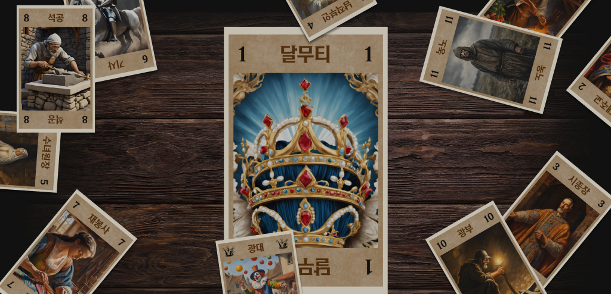

# 나홀로 달무티
<p align="center">
    
</p>

## 달무티 소개
- [게임 설명 영상][]

[게임 설명 영상]: https://youtu.be/sO-vxnoL31A?si=ls5eMAc9QKEPIoIs

## 프로젝트 소개
달무티라는 카드 게임을 혼자서도 간단하게 즐길 수 있는 게임 웹앱을 제작했습니다. 컴퓨터 행동, 플레이어 행동, 진행 상황 로그 등의 기능이 있습니다.<br/>
플레이어의 선택과 행동에 따른 결과와 컴퓨터가 확률적으로 처리하는 결과, 둘에 대한 상호작용이 베이스가 되는 룰에 어긋나지 않도록 제작하고 애니메이션을 통해 실제 플레이 경험에 다가가고자 하면서도 웹이라는 공간에 맞춰 UI를 설계했습니다.<br/>
카드 일러스트에는 Canva로 생성한 Ai 일러스트를 사용했습니다.

### 미리보기
- [https://septupleseven.github.io/dalmuti_alone/][]

[https://septupleseven.github.io/dalmuti_alone/]: https://septupleseven.github.io/dalmuti_alone/
<br/>

### 관련 상세 노션
- [https://www.notion.so/13e675d69a9480af8388c895afa3019b?pvs=4][]

[https://www.notion.so/13e675d69a9480af8388c895afa3019b?pvs=4]: https://www.notion.so/13e675d69a9480af8388c895afa3019b?pvs=4
<br/>

## STACKS   
### Base
- React.js
- TypeScript
### lib
- SCSS
- Zustand
- Framer-motion
<br/>

## 시작하기
### 사전 요구 사항
- Node.js v20 이상

### 설치
```bash
npm install
```

### 프로젝트 실행, 빌드
```bash
npm run dev
npm run build
npm start
```
<br/>

## 콘텐츠 소개   
### 게임 모드 선택

<br/>
게임 시작 버튼을 누르고 게임 모드를 선택합니다.
- 짧은 게임 : 기존 룰에서 먼저 패에 5장 남은 플레이어가 승리하는 것으로 설정합니다. 게임이 짧게 끝납니다.
- 일반 게임 : 기존 룰 그대로 진행합니다. 승리한 플레이어가 나올 시 게임은 종료됩니다.
- 풀 게임 : 기존 룰 그대로 진행합니다. 마지막 한 명의 플레이어가 남을 때까지 진행합니다. 게임이 상당히 길게 진행됩니다.
<br/>

### 플레이 방법

<br/>
내부의 플레이 방법 모달을 활성화하여 플레이 가이드를 볼 수 있습니다. 모달 내부의 영상 자료 링크도 포함되어 있습니다.
<br/>

### 플레이

<br/>
달무티의 기본 룰, 조커 등을 혼자서 즐길 수 있습니다.

### 반응형


<br/>
반응형 레이아웃이 적용되어 있습니다. 원활한 진행은 데스크탑 환경에서 진행하는 것을 권장드립니다.
<br/>
<br/>

## 자료 참조
- 영상 자료 참조
  - [코리아보드게임즈](https://www.youtube.com/watch?v=sO-vxnoL31A)
- 이미지 생성
  - [Canva](https://www.canva.com/ko_kr/)
<br />
본 사이트는 상업적 목적으로 제작된 사이트가 아닙니다.
